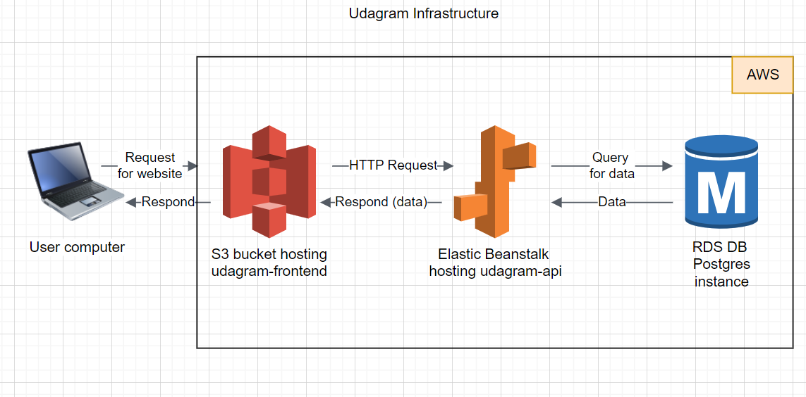
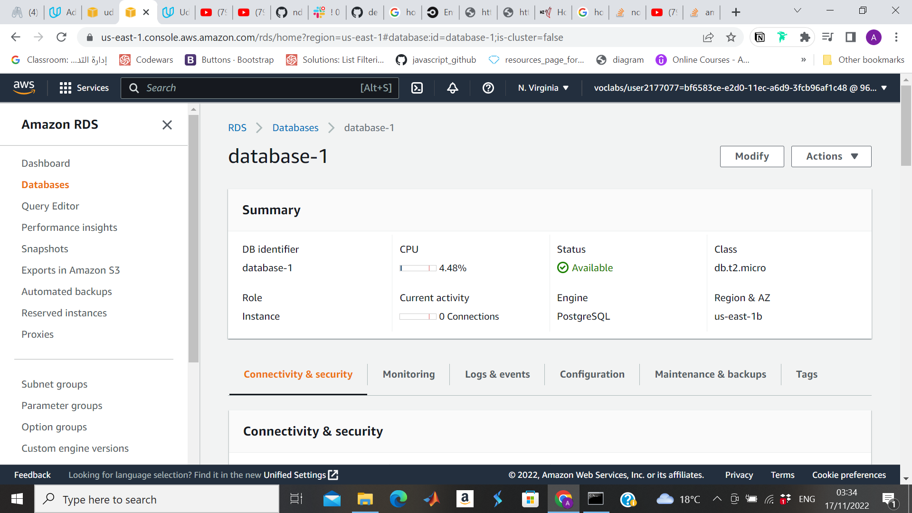
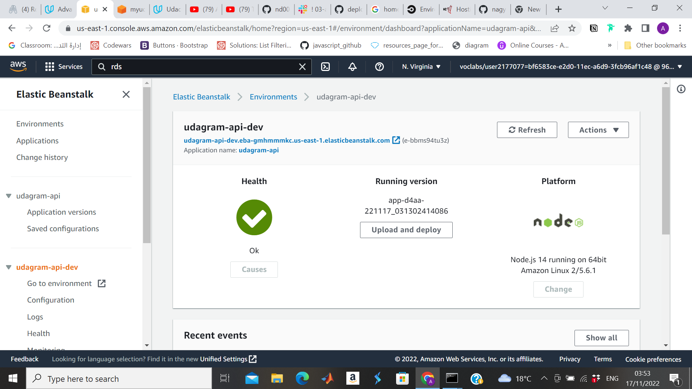
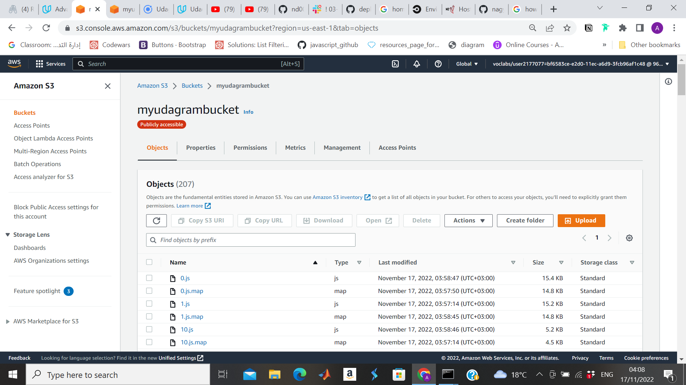

# Infrastructure description for udagram app

## Simple diagram for the infrastructure

## DB (RDS)
 Postgres databse using aws service (RDS) 

## Api (EB)
Node.js app hosted on aws service (Elastic Beanstalk) => udagram-api

## Frontend (S3)
Angular app hosted on aws service (S3) => udagram-frontend

